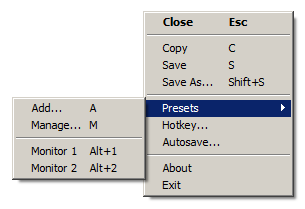

# ScreenCopy
A desktop program that can take a snapshot of the screen and either save it to file or copy it to the clipboard.  
It sits in the background and can be activated with a global hotkey.  
When active it shows a sizeable, transparent window that can be accurately positioned by using the mouse or the keyboard arrow-keys.  
Autosave features make it easy to capture a sequence of views with a minimum of keystrokes.  
Frequently used areas can be saved in a preset list, for quick selection later.  

## Features
#### Menu
All features are accessable via the right-click context menu or via the keyboard.

#### Hotkey
When started for the first time, it will ask to select the hotkey used to activate the screengrabber.

#### AutoSave
When saving a file with autosave enabled it will not prompt for a filename, instead the file will be saved in a predefined location with a predefined filename.

#### Portability
When starting, it will look for the file ScreenCopy.ini in it's program directory. If it is found, it will be used to store settings, else settings will be stored in the registry. 

#### Presets
Press the 'A' key to save the current selection rectangle as a preset, you will be prompted for a description (mandatory).

#### Caveats
ScreenCopy, when in the background, has no other user interface then the hotkey.
Also it is easy to lose track of the grabber-window; when it is too small it can become very hard to find on the screen or to interact with it.  

When the program is started, and it was already running, it will activate the running instance and move it's window to the center of the main monitor.

## Building

#### Prerequisites:

[WTL](https://sourceforge.net/projects/wtl/), the Windows Template Library.

A Visual Studio 2017 project file is included.
