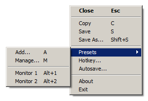
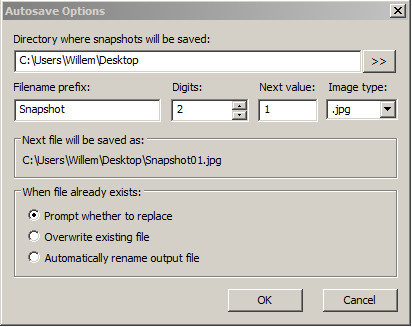
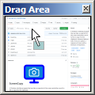
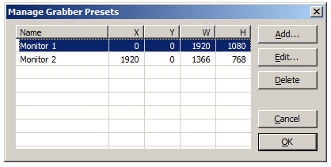

# ScreenCopy 
A Windows desktop program that can take a snapshot of the screen and either save it to file, copy it to the clipboard or show it in a window from which it can be dragged into another application.  
Autosave features make it easy to capture a sequence of views with a minimum of keystrokes.  
When active it shows a sizeable, transparent window that can be positioned accurately by using the mouse or the keyboard arrow-keys.  
It sits in the system tray and can be activated with a global hotkey.  
Frequently used areas can be saved in a preset list, for quick selection later.  

## Features
#### Menu
All features are accessable via the right-click context menu or via the keyboard.

#### Hotkey
When started for the first time, you will be asked to select the hotkey used to activate the screengrabber.

#### AutoSave
When auto-saving a file you will not be prompted for a filename, instead the file will be saved in a definable location with a definable filename (default: user desktop).

#### Drag Area
Double clicking the selection window will transfer the selection to the "Drag Area".
This is a window that shows a thumbnail of the selected area, this thumbnail can be dragged into applications that allow image files to be dropped in.

#### Portability
By default settings are saved in the registry (HKCU\Software\toptools.org\ScreenCopy).  
In case you don't want or cannot write the registry, ScreenCopy can run in "portable" mode:
Create a file called "ScreenCopy.ini" next to the .exe and it will use that to store settings.

#### Presets
Press the 'A' key (or use the menu) to save the current selection rectangle as a preset, you will be prompted for a description (mandatory).  
The first 9 presets will be bound to the Alt+1 .. Alt+9 keys.

#### Miscellaneous
It it is easy to lose track of the grabber-window; when it is too small it can become very hard to find on the screen or to interact with it.  
When the program is started, and it was already running, it will activate the running instance and move it's window to the center of the main monitor.

## Building
#### Prerequisites:
[WTL](https://sourceforge.net/projects/wtl/), the Windows Template Library.  
A Visual Studio 2017 solution file is included.
