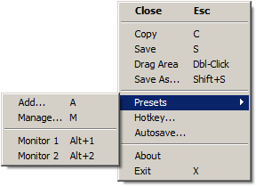

# ScreenCopy 
A Windows desktop program that can take a snapshot of the screen and either save it to file or copy it to the clipboard.  
Autosave features make it easy to capture a sequence of views with a minimum of keystrokes.  
When active it shows a sizeable, transparent window that can be positioned accurately by using the mouse or the keyboard arrow-keys.  
It sits in the background and can be activated with a global hotkey or via a tray-icon.  
Frequently used areas can be saved in a preset list, for quick selection later.  

## Features
#### Menu
All features are accessable via the right-click context menu or via the keyboard.

#### Hotkey
When started for the first time, it will ask to select the hotkey used to activate the screengrabber.

#### AutoSave
When auto-saving a file you will not be prompted for a filename, instead the file will be saved in a definable location with a definable filename.

#### Portability
By default, settings will be saved in the registry, but when a file called 'ScreenCopy.ini' is found in the program directory it will be used to store settings instead. 

#### Presets
Press the 'A' key (or use the menu) to save the current selection rectangle as a preset, you will be prompted for a description (mandatory).  
The first 9 presets will be bound to the Alt+1 .. Alt+9 keys.

#### Miscellaneous
When the program is started, and it was already running, it will activate the running instance and move it's window to the center of the main monitor.

## Building
#### Prerequisites:
[WTL](https://sourceforge.net/projects/wtl/), the Windows Template Library.  
A Visual Studio 2017 solution file is included.
